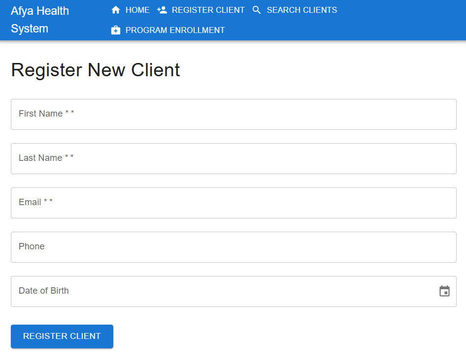
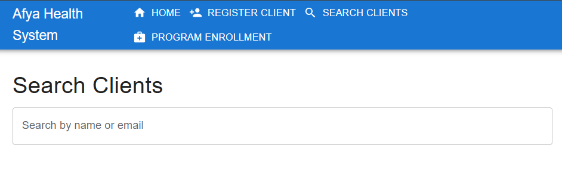

# Afya Health System 🏥

[](https://github.com/SamBudah/afya-health-system/stargazers)

A secure health information management system for tracking clients and their program enrollments, built with React, Node.js, and Firebase.

![Afya System Screenshot]




## Features ✨
- 📝 Client registration
- 🔄 Client-program enrollment tracking
- 🔍 Advanced client search
- 🔒 Secure REST API for integrations
- 📊 Responsive admin dashboard

## Technology Stack 🛠️
| Component       | Technology               |
|-----------------|--------------------------|
| Frontend        | React 18, Material-UI    |
| Backend         | Node.js, Express.js      |
| Database        | Firebase Firestore       |
| Authentication  | Firebase Auth            |
| API Docs        | Swagger UI               |

## Security Measures 🔐
- Environment variable configuration
- GitHub secret scanning enabled
- Automatic credential rotation
- Pre-commit/push hooks to prevent secret leakage

## Getting Started 🚀

### Prerequisites
- Node.js v16+
- Firebase project
- Git

### Installation

1. **Clone the repository**
   ```bash
   git clone https://github.com/SamBudah/afya-health-system.git
   cd afya-health-system